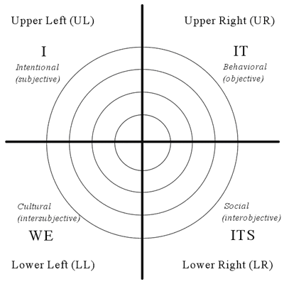

# Systemic Data Ethics Framework

The Systemic Data Ethics Framework defines 12 domains, which when taken together, comprise a stable view of the whole field of data ethics, even as our understanding of what is involved evolves daily. This document outlines some of the systemic process used to create this stability.

## A framework for collaboration

The ethical standards applied throughout the lifecycle of technological innovation impact the whole of society and play a defining role in our global future.  As the rate of progress continues to accelerate, so too do the ethical challenges, constantly requiring the integration of new concepts and  perspectives. The complexity, nuance and rate of change means that no individual can claim to be an expert in every aspect of data and technological ethics. The standards and decision making practices required in the field of data ethics and responsible innovation can only evolve through cooperation, openness, curiosity and a commitment to ongoing transformation. 

The Systemic Data Ethics Framework is a framework for collaboration and co-evolution. Instead of beginning with an analysis of current practice and understanding, it starts from the perspective of the whole system, and identifies a fixed set of twelve domains, each of which represents a constituent part of what is required to make data ethics “real”. The structure of the system makes it stable, while simultaneously able to integrate new and diverse perspectives - even in an environment of constant change and innovation. This capacity to absorb new information provides foundation for managing the incredible complexity of the field, enables cross-disciplinary, multi-cultural collaboration, promotes questioning and reveals inter-connectedness. 

The framework will be released and developed as open source. Open source and co-creation has, over the last few decades, driven unheralded innovation. The model fosters collaboration at scale, creates new business opportunities and drives systemic change. By investing in, and sharing, an open framework we hope to accelerate adoption and transformation by reducing the costs related to establishing and operationalising data ethics within organizations. 

Without an ethical foundation, data, AI and technological innovation have the potential to cause massive harm to every aspect of society and the biosphere. With the right base however these same tools are key to providing the light at the end of the tunnel. Establishing a collaborative, systemic, human-centred approach as the default way of engaging with data ethics is the place to start.

## An integral map of data ethics

While most approaches to frameworks start by classifying existing knowledge, a systemic framework is established by first defining the properties of the whole system, and then integrating information. While a systemic approach may not produce the same efficient, clearly defined, parameters as an analytical approach, it is highly effective at reducing the complexity in areas of innovation and uncertainty by being able to constantly incorporate new information and evolve without needing to change it’s structure.  

**The Systemic Data Ethics Framework does not seek to replace or supersede other data ethics frameworks. Its purpose is to integrate approaches and to reveal how each framework presents a different perspective.**

The Systemic Data Ethics Framework breaks the field of data ethics and responsible innovation into a whole consisting of 12 possible domains. While each of these domains is be given a name, their actual properties emerge from the combination of a deeper set of properties. *The specific names of each domain are not fixed and are free to evolve in future versions of the framework, the underlying properties of each domain however, remain constant.*

### General systemic properties
The Systemic Data Ethics domains arise from the combination of two sets of systemic properties:  levels and dimensions. Within  Systemic Data Ethics these properties have been given names relevant to the context.

#### Three levels

A system can be defined as “a regularly interacting or interdependent group of items forming a unified whole”. As such, it is possible to map a system by looking at three different levels:

1. **Components**: The components of the system
2. **Relationships**: The relationships between components
3. **Whole**: The boundary that defines what is within and without the system

#### Four Dimensions

The four systemic dimensions of the Systemic Data Ethics Framework are, in part, inspired by the dimensions/quadrants of Integral Theory. These dimensions have been defined in a way that allows any approach to a topic to be assigned to a category.

## Systemic Data Ethics Application

These general systemic concepts have been applied within a data ethics context to create the foundations of the Systemic Data Ethics framework.

### The Three Systemic Data Ethics Levels

| Level | Overview | Keywords | Domains
 ------| ---------                     | --------------| --------
**Governance** | The work required at an organizational level to use and manage data and AI within an economic or social context. This includes a business decisions and it’s strategy to commercialise data, an organization’s structure, the way in which it communicates (and listens to) the public as well as the long term, social and environmental impact of any data or AI use. | Whole. Organization, Leadership, C-suite | Strategy, Accountability, Transparency, Sustainability
**Operations** | The ethical issues related to the ongoing operation of data and AI products and services. These tend to be internal to the organization, focusing on the teams and practices involved in using AI or data tools. This level includes day-to-day management of tools, technical infrastructure and security, the quality of algorithms, and the understanding of the human consequences of tools. | Relationships. Management, teams | Fairness, Infrastructure, Application,  Consequences
**Design** | The ethics of creating products that use data and AI. Much of this work is undertaken by primarily individuals. The selection of problems and user needs to solve, the raw data, the rules and regulations that define ethical standards and the participation, inclusivity and culture of teams designing these systems. | Components.  Individuals | Agency, Materials, Compliance,  Inclusivity

### The Four Systemic Data Ethics Dimensions

Dimension | Overview | Keywords | Domains
--- | --- |--- |---
Intention |The ethical decisions required to achieve goals and objectives, at an individual/design level, day-to-day operations and strategy.| Action. Intention. Strategy. Risks. Decisions. Data Rights. | Strategy, Fairness, Agency
Implementation | The ethics of practical implementation, at the levels of specific data-sources, technical infrastructure and organizational structure | Data. Human resources. Tools. Infrastructure. Capabilities. Encryption. Security. | Accountability, Infrastructure, Materials
Information | The ethics of working with information and processes. Internal process, external regulation, algorithms, value optimisation, and the transparency of external communications | Process, regulation, algorithms, transparency, feedback. | Transparency, Application, Compliance
Implication | The human, and often unplanned, influences and impact. Organizational culture, diversity, the effect products have on human rights and communities, and the bigger changes in society. | Culture, inclusivity, consequences, harms, benefits, sustainability | Sustainability, Consequences,  Inclusivity

## The Systemic Data Ethics Domains

Combining these levels and dimensions results in a set of 12 domains. The Systemic Data Ethics Framework provides a set of contextually relevant names and descriptions for each of these domains.  

### Governance level ethics domains

Dimension | Domain | Description
--- | --- | ---
Intention | **Strategy**  | The organization’s principles, and it’s approach to the opportunity and risks related to using and commercialising data.
Implementation | **Accountability** | The way in which the organization is structured to effectively work with data and ensure accountability.
Information | **Transparency** | How an organization communicates it’s data use policies, and it’s willingness to receive feedback.
Implication | **Sustainability** | The organizations awareness of the long term impact of it’s work on society and the way in which it is perceived by the public.

### Operations level ethics domains

Dimension | Domain | Description
--- | --- | ---
Intention | **Fairness** | The alignment of a business’s objectives and the rights of individuals.
Implementation | **Infrastructure** |A team’s human and technical competency for working with data, creating software and securing it’s systems.
Information| **Application** |The ability to effectively work with data to inform decision making, algorithms and all the relevant trade-offs. 
Implication| **Consequences** |The awareness of the positive and negative impact on the lives of individuals, as a result of data based products and decisions.

### Design level ethics domains

Dimension | Domain | Description
--- | --- | ---
Intention | **Agency** | The ability of individuals to work with data and operationalised ethical boundaries.
Implementation | **Materials** | The availability and quality of data and the tools for working with it ethically.
Information | **Compliance** | The clarity of guidance on how to work with data according to internal policy and external regulation.
Implication | **Inclusivity** | The diversity of participation in product design and the psychological safety required to raise ethical challenges.

## It’s just a map

It is important to mention that the Systemic Data Ethics Framework has been designed to facilitate the exploration of the unknown. This combination of levels and dimensions is not intended to be exact, and any boundaries are completely artificial. In practice, most work will fit into multiple possible domains, and there will always be a requirement for accurate, domain specific frameworks. 

However, one of the most valuable attributes of this framework is that it will remain consistent, no matter how much the field of data ethics advances. We will need to create new releases to refine names and definitions as our understanding grows, but the underlying structure will remain fixed. 

The Systemic Ethics Framework provides a stable foundation in an unknown and unstable environment. It is possible to build long term strategies based on this map, with the confidence that the map is accurate enough. 
