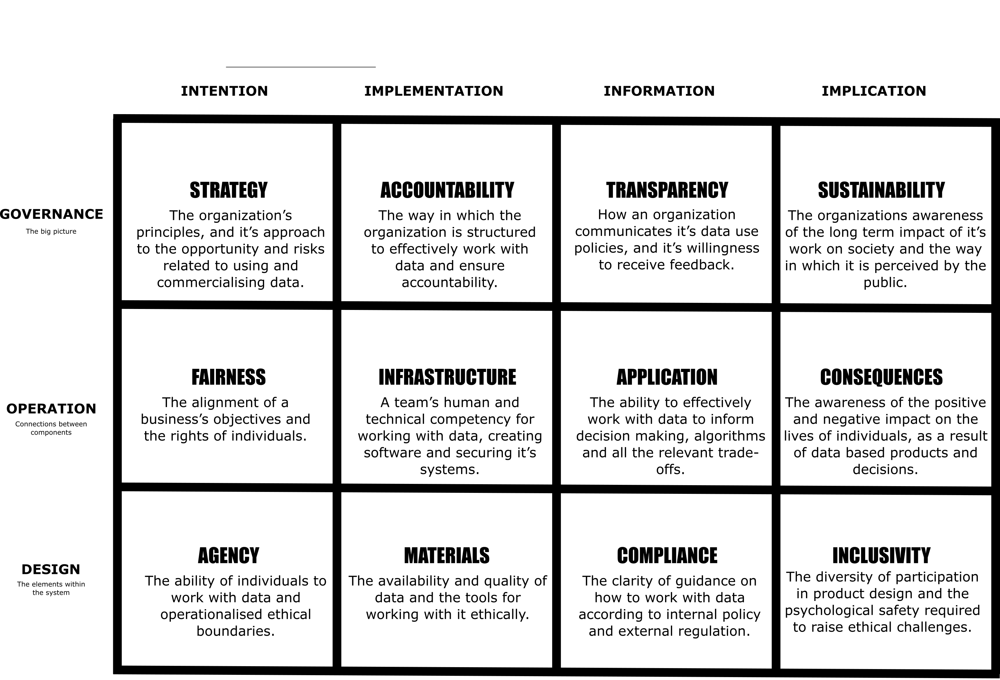

# Systemic Data Ethics Framework

Version: {{ Page.version }}

The Systemic Data Ethics Framework defines 12 domains, which when taken together, comprise a stable view of the whole field of data ethics, even as our understanding of what is involved evolves daily. This document outlines some of the systemic process used to create this stability.

